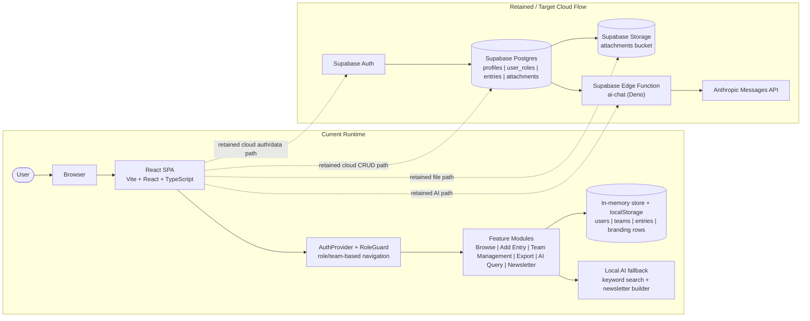

# Parul Nerve

Parul Nerve is a role-based knowledge hub for Parul University teams. The current application is a `Vite + React + TypeScript` single-page app with dashboard, browse, entry creation, export, team-management, and AI-assisted content flows.

## System Overview

The active runtime is currently local-first:

- UI and routing run through `React`, `React Router`, and a shared app shell in `src/App.tsx` and `src/components/AppLayout.tsx`.
- Authentication, role resolution, and dashboard routing are handled in-browser through `src/hooks/useAuth.tsx`.
- Entries, users, teams, and branding rows are persisted through an in-memory plus `localStorage` store in `src/lib/db.ts`.
- The live role model is `super_admin`, `admin`, `sub_admin`, and `user`.
- The built-in teams are `branding` and `content`, with support for custom teams in the local store.

Supabase is still architecturally relevant in the repo, but not currently active in the main frontend runtime:

- `src/integrations/supabase/client.ts` is stubbed/disconnected.
- `supabase/migrations/` still defines the retained cloud schema, including `profiles`, `user_roles`, `entries`, and `attachments`.
- `supabase/functions/ai-chat/index.ts` still defines a Supabase Edge Function that calls the Anthropic Messages API for chat and newsletter generation.
- `supabase/config.toml` and `src/integrations/supabase/types.ts` show the retained cloud project wiring and generated types.

## System Design And Workflow

> Note: `src/integrations/supabase/client.ts` is currently stubbed, so the Supabase services shown above are retained cloud architecture artifacts in the repo, not the active frontend runtime path today.

## Tech Stack

### Runtime And Application Stack

- `React 18`
- `TypeScript`
- `React Router`
- `TanStack React Query`
- `Tailwind CSS`
- `shadcn/ui`-style component set in `src/components/ui`
- `Radix UI`
- `Lucide React`
- Browser persistence via `localStorage`
- `Supabase` project config, generated types, and SQL migrations
- `Supabase Edge Functions` running on `Deno`
- `Anthropic` Messages API for AI chat and newsletter generation

### Developer Tooling

- `Vite`
- `@vitejs/plugin-react-swc`
- `ESLint`
- `Vitest`
- `Testing Library`
- `jsdom`
- `Playwright`
- `PostCSS`
- `npm`
- Lockfiles present for both `npm` and `bun` via `package-lock.json`, `bun.lock`, and `bun.lockb`

## Workflow Narrative

1. A user opens the app in the browser and lands on the `React` SPA.
2. `AuthProvider` reads the local session key, resolves the user record from `src/lib/db.ts`, and determines the active role and team.
3. `RoleGuard` and route configuration decide which dashboard and navigation options are available.
4. Team members create and browse knowledge entries through the shared entry store, with entry types scoped by team where applicable.
5. Admin and super-admin users manage users, roles, and team assignments; the local store also supports custom teams beyond the built-in `branding` and `content` groups.
6. Export, AI query, and newsletter flows consume the same local knowledge base in the current implementation.
7. AI query and newsletter pages currently use offline/local fallback behavior against local entry data instead of the retained cloud AI path.
8. In the retained target architecture, frontend AI actions would call the Supabase `ai-chat` Edge Function, which would read the structured knowledge-base data and forward generation requests to Anthropic.

## Current Vs Retained Architecture

The repo currently reflects two overlapping system shapes:

- The implemented frontend runtime is local-first and browser-persistent.
- The retained backend architecture is Supabase-based, with schema, storage, and edge-function assets still present in the repository.

That distinction matters when discussing the system design: the local `AuthProvider` and `db` modules define how the app works now, while the Supabase schema and `ai-chat` function define the cloud path the project can reconnect to later.
