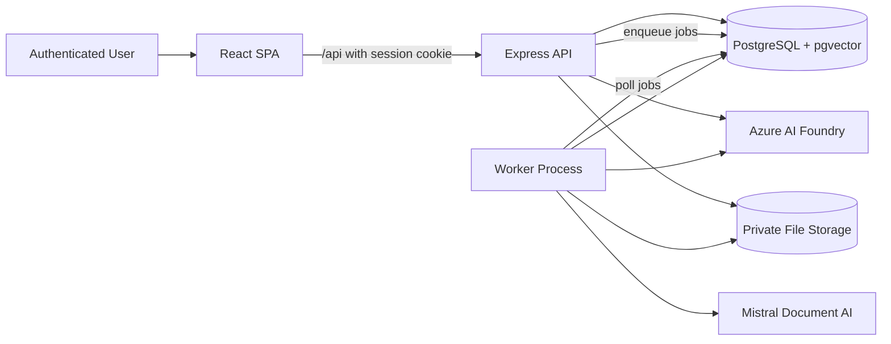

# Architecture Decision Document

## Executive Summary

Nerve should implement the new RAG assistant as a brownfield extension of the existing React SPA, Express API, and PostgreSQL runtime rather than as a new service platform or a Supabase revival. The assistant keeps the current `/ai/query` route, `AppLayout`, `RoleGuard`, session auth, and PostgreSQL authority model, while adding a dedicated knowledge pipeline, retrieval layer, and operator-safe source access path.

The recommended architecture is a PostgreSQL-native hybrid RAG layer inside the current Express application boundary. PostgreSQL remains the source of truth for business data, permissions, sessions, indexed knowledge metadata, chunks, and job status. Azure AI Foundry is used for generation and embeddings. Mistral Document AI is used for extraction in the upload phases. The existing `entries` table remains intact and becomes the first indexed corpus for MVP.

This architecture is intentionally phased:

- Phase 1 replaces the fake/local `AIQuery` behavior with grounded retrieval over existing `entries`.
- Phase 2 adds private uploads, OCR/extraction, and permission-safe source access for files, PDFs, and images.
- Phase 3 adds asset governance and operational tooling.
- Later phases add saved threads, analytics, and tuning.

The result is a trustworthy, citation-first assistant that feels native to Nerve and does not create a second source of truth for auth or ACL.

## Project Context Analysis

### Requirements Overview

**Functional Requirements**

The PRD defines one assistant surface that supports `Auto`, `Search`, and `Ask` modes for authenticated users. It must combine natural-language search, grounded synthesis, citation inspection, source preview/open actions, explicit no-answer behavior, permission-aware retrieval, and phased support for uploaded files, PDFs, and images. Admin and operator capabilities must cover upload, indexing state, retry, reindex, and investigation workflows.

Architecturally, the requirement set breaks down into six capability groups:

- assistant experience and query orchestration
- hybrid retrieval across structured and unstructured knowledge
- grounded answer generation with citations
- ACL-safe source governance and downloads
- ingestion and reindexing workflows
- operations, evaluation, and observability

**Non-Functional Requirements**

The architecture is strongly constrained by trust and brownfield fit:

- search p95 latency at or below 2.5 seconds for the initial corpus
- answer p95 latency at or below 8 seconds, excluding ingestion
- zero unauthorized filename, snippet, citation, or source-link leakage
- searchable updates within 5 minutes for entry changes
- WCAG 2.1 AA coverage for composer, modes, results, citations, and evidence rail
- explicit no-answer behavior when evidence is weak
- telemetry for latency, failures, citation coverage, no-answer rate, and cost

**Scale & Complexity**

This is a medium-complexity brownfield full-stack feature with high cross-cutting sensitivity. The implementation is not large because of raw UI surface area; it is large because permissions, evidence grounding, ingestion, and operations must all remain coherent inside an existing product.

- Primary domain: authenticated web application with server-side retrieval orchestration
- Complexity level: medium-high brownfield
- Estimated new architectural components: 12 to 15 feature modules across client, API, worker, storage, retrieval, and operations

### Technical Constraints & Dependencies

- Keep the active runtime on the existing Vite/React SPA, Express API, and PostgreSQL stack.
- Preserve the current route at `/ai/query`.
- Preserve `AppLayout`, `RoleGuard`, `useAuth()`, cookie-based `/api` access, and same-origin deployment.
- Treat retained Supabase assets as reference only, not as live runtime dependencies.
- Keep `entries` as a first-class business table and phase-1 knowledge source.
- Use PostgreSQL 16 with `pgvector`; also enable `pg_trgm` and PostgreSQL full-text search for hybrid retrieval.
- Use Azure AI Foundry with `gpt-4.1-mini`, `gpt-4.1-nano`, and `text-embedding-3-small`.
- Use `mistral-document-ai-2512` with fallback to `mistral-document-ai-2505` for extraction once uploads are introduced.
- Do not expose private assistant files through the current public `/uploads` static-serving pattern.

### Cross-Cutting Concerns Identified

- Permission enforcement must happen authoritatively at retrieval time and download time.
- Citation coverage is a product requirement, not a UI enhancement.
- No-answer behavior must be server-enforced, not prompt-only.
- Knowledge freshness and policy versioning matter because academic guidance changes over time.
- Async ingestion and retry behavior must be visible to both users and operators.
- The architecture must avoid further bloating `server/index.ts`, `server/db.ts`, and `useAppData()`.

## Brownfield Baseline Evaluation

### Selected Baseline

The selected foundation is the existing Nerve application itself:

- React 18 SPA in `src/`
- Express 4 API in `server/`
- PostgreSQL 16 with `pgvector`
- cookie/session auth through `/api`
- Nginx + Docker Compose deployment on the current VPS topology

This is not a greenfield starter decision. It is a brownfield preservation decision.

### Why The Existing Runtime Is The Right Foundation

- The current app already has role-aware navigation, session auth, and team context.
- PostgreSQL already holds the source business records and session store.
- `server/db.ts` already enables the `vector` extension.
- The active UI route and shell already exist, so assistant adoption can happen inside familiar flows.
- The PRD explicitly requires keeping the runtime on React + Express + PostgreSQL.

### Brownfield Guardrails

The implementation must not:

- reintroduce Supabase as the live retrieval/auth/runtime path
- overload `/api/bootstrap` with assistant session state or search results
- keep using the current `AIQuery` local keyword fallback
- reuse public `/uploads` serving for protected assistant documents
- treat this feature as a reason to rewrite the rest of the app

### Brownfield Starter Decision

There is no new project initializer for this work. The brownfield equivalent of a starter choice is:

- keep the repo and deployment shape
- add dedicated `server/rag/*` modules
- add a worker process in the same repo/runtime family
- add frontend feature modules under `src/features/assistant/*`
- add migration files for the RAG schema instead of expanding one more large DDL block inside `server/db.ts`

**First implementation priority:** establish the RAG schema/migration baseline and server module scaffolding, then replace `/ai/query` with entry-backed grounded retrieval.

## Core Architectural Decisions

### Decision Priority Analysis

**Critical Decisions (Block Implementation)**

- Express remains the only application boundary for assistant queries, ingestion, citations, and downloads.
- PostgreSQL remains the authority for permissions, indexed knowledge metadata, chunks, jobs, and citation traceability.
- Retrieval uses a hybrid stack: metadata filters + full-text search + trigram matching + vector similarity.
- ACL is enforced at retrieval time and download time from authoritative relational data.
- Phase 1 indexes existing `entries` only; files/PDFs/images enter in Phase 2.
- Private assistant assets are served only through authenticated proxy endpoints or signed URLs behind ACL checks.
- Assistant behavior is `Auto`, `Search`, and `Ask`, with server-enforced no-answer behavior.

**Important Decisions (Shape Architecture)**

- Introduce `server/rag/*` as a dedicated module family rather than expanding `server/index.ts` and `server/db.ts`.
- Introduce a separate worker process and PostgreSQL-backed job queue.
- Use lightweight SQL migrations for new RAG schema objects.
- Use React Query for assistant-specific network state while leaving existing provider-based screens intact.
- Keep `src/pages/AIQuery.tsx` as a route wrapper, but move new assistant logic into `src/features/assistant/*`.

**Deferred Decisions (Post-MVP)**

- streaming responses
- saved threads/messages/citations persistence
- full admin asset-management surface
- advanced evaluation dashboards
- object-store-first production storage if the current VPS storage model becomes limiting

### Target Runtime Topology



### Data Architecture

**Business tables remain authoritative**

The existing tables remain the system of record for application behavior:

- `users`
- `teams`
- `entries`
- `branding_rows`
- `session`

The RAG layer is a derived knowledge index and operations layer. It does not replace the business tables.

**New RAG tables**

Add the following tables:

- `knowledge_assets`
- `knowledge_asset_versions`
- `knowledge_chunks`
- `knowledge_acl_principals`
- `knowledge_jobs`
- optional later: `assistant_threads`, `assistant_messages`, `assistant_message_citations`

**Schema role of each table**

- `knowledge_assets`: one row per retrievable unit, linked back to `entries` or uploaded content
- `knowledge_asset_versions`: extracted/normalized version history
- `knowledge_chunks`: chunked retrieval units with `tsvector`, `vector(1536)`, and citation locators
- `knowledge_acl_principals`: explicit ACL rows for non-default visibility
- `knowledge_jobs`: extraction, normalization, chunking, embedding, reindex, ACL refresh, and failure tracking

Recommended asset status values are:

- `pending`
- `processing`
- `ready`
- `failed`
- `deleted`

**Visibility defaults**

- Existing `entries` default to `visibility_scope = 'authenticated'` to preserve current app behavior.
- New uploads default to private scopes such as `owner`, `team`, or `explicit_acl`.
- ACL changes update authoritative asset rows immediately; embeddings can lag, but retrieval must respect the newest ACL state.

**Migration strategy**

The current app uses startup bootstrap DDL in `server/db.ts`, but the RAG schema should use versioned SQL migrations under `server/migrations/`. The migration runner executes before the API listens or the worker starts. This prevents RAG schema evolution from becoming another long-lived code-managed DDL block.

**Index strategy**

- `CREATE EXTENSION IF NOT EXISTS vector`
- `CREATE EXTENSION IF NOT EXISTS pg_trgm`
- GIN on `search_vector`
- HNSW on `embedding`
- B-tree indexes for ACL and common filters
- trigram index on title/file-name lookup paths

### Authentication & Security

**Auth model**

Reuse the current session model:

- browser authenticates through `/api/auth/*`
- session cookie is stored by Express
- current user is resolved from PostgreSQL on each authenticated request

No separate AI auth boundary is introduced.

**ACL model**

Permission evaluation must be based on:

- current session user id
- role
- team
- asset ownership
- explicit ACL principals when present

Every one of the following uses the same ACL decision path:

- retrieval candidates
- snippets
- citations
- evidence preview
- source open/download
- job visibility for privileged users

**Security boundary correction**

The current `app.use("/uploads", express.static(...))` pattern is acceptable for public branding images but not for private assistant documents. Assistant assets must use a storage adapter with authenticated file access.

**Storage policy**

- MVP: entry-only, so no private binary store required yet
- Phase 2+: storage adapter supports `disk-private` for current VPS deployment and a future cloud object store backend
- no assistant asset path is directly public

### API & Communication Patterns

**New endpoint groups**

Add the following REST surfaces under `/api`:

- `POST /api/assistant/query`
- `GET /api/assistant/threads`
- `GET /api/assistant/threads/:id`
- `POST /api/knowledge/uploads`
- `GET /api/knowledge/assets`
- `GET /api/knowledge/assets/:id`
- `POST /api/knowledge/assets/:id/reindex`
- `GET /api/knowledge/assets/:id/download`
- `GET /api/knowledge/jobs`
- `GET /api/knowledge/jobs/:id`

**Query contract**

The assistant query contract should use `mode: auto | search | ask`, preserve named JSON payloads, and be explicit about evidence:

```json
{
  "result": {
    "mode": "search",
    "answer": null,
    "enough_evidence": true,
    "grounded": false,
    "citations": [],
    "results": [
      {
        "asset_id": "asset_123",
        "title": "Attendance Guidelines 2025",
        "source_kind": "uploaded_file",
        "media_type": "pdf",
        "page_from": 4,
        "snippet": "Students must maintain a minimum attendance of 75%..."
      }
    ],
    "follow_up_suggestions": [
      "Switch to Ask mode",
      "Filter to PDFs"
    ],
    "request_id": "req_abc123"
  }
}
```

**No-answer policy**

The server decides whether evidence is sufficient before generation. If the evidence threshold is not met, the system returns either:

- a search-style result set without narrative synthesis, or
- a no-answer response with helpful next actions

The model is never asked to produce a confident answer from weak evidence.

**Response-shape consistency**

Existing API behavior uses named payload wrappers and `{ message }` errors. The assistant APIs should keep that convention:

- reads return `{ result }`, `{ thread }`, `{ assets }`, `{ jobs }`
- mutations return `{ asset }`, `{ job }`, or `{ ok: true }`
- failures return `{ message }`

### Retrieval & Answering Architecture

**Retrieval pipeline**

Each assistant query executes through these stages:

1. resolve session user and ACL context
2. normalize the query and filters
3. determine `auto` intent outcome using deterministic rules first and `gpt-4.1-nano` only when necessary
4. generate candidates from:
   - metadata/exact match
   - PostgreSQL FTS
   - trigram title/file similarity
   - vector similarity
5. apply ACL-safe candidate union and RRF fusion
6. collapse adjacent chunk hits from the same asset
7. decide whether evidence is sufficient for `ask`
8. if sufficient, call `gpt-4.1-mini` with only the selected evidence
9. return citations, snippets, and optional follow-ups

**Citation storage**

Each retrieval chunk carries a machine-usable `citation_locator` JSON payload including:

- `asset_id`
- `asset_version_id`
- `chunk_id`
- `title`
- `source_kind`
- `page_from`
- `page_to`
- `heading_path`
- `char_start`
- `char_end`

Human-facing citations are rendered as `S1`, `S2`, `S3`, optionally with page labels.

### Frontend Architecture

**Brownfield UI decisions**

- Keep the route at `/ai/query`.
- Keep the page inside `AppLayout` and current `RoleGuard` behavior.
- Rename sidebar/dashboard labels from `Ask AI` to `Assistant`, but do not change the route.
- Keep `AINewsletter` separate.

**State management decision**

Do not push assistant data into `useAppData()` or `/api/bootstrap`. The assistant is request-heavy, role-aware, and increasingly asynchronous. It should use feature-scoped hooks backed by React Query and page-local UI state.

This produces a mixed client architecture by design:

- `useAuth()` remains the auth authority
- `useAppData()` remains the bootstrap/CRUD authority for existing core screens
- `src/features/assistant/*` uses React Query for assistant requests, uploads, job polling, and source details

**UI structure**

The new assistant page uses a two-layer structure:

- route wrapper in `src/pages/AIQuery.tsx`
- feature implementation under `src/features/assistant/*`

The feature should contain:

- page shell
- mode bar
- query composer
- response blocks
- answer card
- result group and source cards
- evidence rail or mobile sheet
- filter sheet
- empty/loading/error/no-answer states
- role-gated upload dialog for later phases

**UX behavior rules**

- `Auto` defaults on first load
- known-item verbs prefer search-first layout
- synthesis questions prefer answer-first layout
- citation clicks open the evidence rail without route changes
- mobile moves filters and evidence into sheets/drawers
- no trust-critical state is conveyed only by color

### Infrastructure & Deployment

**Worker process**

Add a new worker entrypoint that uses the same codebase and environment family as the API. In deployment, add a `worker` service to `docker-compose.yml` using the same image as `api` with a different command.

**Job queue**

Use PostgreSQL as the job queue with:

- `FOR UPDATE SKIP LOCKED`
- attempt counts and backoff
- dead-letter status
- optional `LISTEN/NOTIFY` later

**Provider integrations**

- generation: Azure AI Foundry `gpt-4.1-mini`
- lightweight classification/fallback: `gpt-4.1-nano`
- embeddings: `text-embedding-3-small`
- extraction: `mistral-document-ai-2512` fallback `mistral-document-ai-2505`

**Configuration additions**

Extend config with environment variables for:

- Azure Foundry endpoint, deployment names, and credentials
- extraction provider credentials
- storage backend type and root/container
- worker polling and retry settings
- assistant feature flags

**Observability**

Introduce a small observability layer for:

- request ids
- stage-level timings
- retrieval counts
- no-answer rate
- ingestion status
- job failures
- provider cost metrics

### Decision Impact Analysis

**Implementation Sequence**

1. Add migration runner and RAG schema baseline.
2. Create `server/rag/*` modules and mount routes from `server/index.ts`.
3. Implement entry-to-knowledge asset synchronization and worker queue.
4. Implement hybrid retrieval and server-enforced no-answer behavior.
5. Replace `src/pages/AIQuery.tsx` with the new assistant feature page.
6. Add citation preview and source-open flow for `entries`.
7. Add telemetry and evaluation harness.
8. Introduce private uploads and extraction in Phase 2.

**Cross-Component Dependencies**

- Query UX depends on retrieval and citation schemas being stable.
- Source-open flows depend on ACL and storage adapter contracts.
- Ingestion visibility depends on job status schema and polling hooks.
- Future threads depend on stable message/citation identifiers.

## Implementation Patterns & Consistency Rules

### Pattern Categories Defined

The main conflict points for multiple AI agents in this repo are:

- mixed current state patterns (`useAppData()` vs React Query)
- monolithic current server files
- mixed naming styles between SQL rows and TypeScript code
- permission-sensitive source access
- status-heavy async flows for ingestion and answer generation

### Naming Patterns

**Database Naming Conventions**

- table names are plural snake_case: `knowledge_assets`
- column names are snake_case: `owner_user_id`, `page_from`, `enough_evidence`
- join tables are also snake_case and pluralized by entity meaning
- constraints/indexes use `idx_<table>_<field>` or `uq_<table>_<field>`

**API Naming Conventions**

- routes stay plural and resource-oriented: `/api/knowledge/assets/:id`
- path params use `:id`
- JSON payload fields that mirror persisted domain fields stay snake_case
- enum values are lowercase snake_case unless UX strings require title case

**Code Naming Conventions**

- React components: `PascalCase.tsx`
- hooks: `useX.ts` or `useX.tsx`
- client/server utility modules: kebab-case multiword file names
- TypeScript variables/functions: camelCase
- Zod schemas end in `Schema`
- query/mutation hook names start with `useAssistant...` or `useKnowledge...`

### Structure Patterns

**Project Organization**

- Keep `src/pages/AIQuery.tsx` thin; put feature logic in `src/features/assistant/*`
- Keep legacy business CRUD in current hooks/modules unless explicitly refactored
- Put all new assistant server logic under `server/rag/*`
- Keep provider integrations behind adapters in `server/rag/providers/*`
- Keep storage backends behind adapters in `server/rag/storage/*`
- Keep worker logic out of `server/index.ts`

**Test Organization**

- client assistant tests: `src/test/assistant/*`
- server RAG tests: `server/test/rag/*`
- end-to-end assistant flows: `tests/e2e/assistant/*`

### Format Patterns

**API Response Formats**

- all REST reads return named payloads
- all errors return `{ message: string }`
- assistant results include explicit `grounded` and `enough_evidence` flags
- citations always include stable machine ids plus UI-facing labels

**Date And Time Rules**

- persist timestamps in UTC
- send ISO 8601 strings over the API
- format for display only in the UI layer

**Status Rules**

Use shared status enums rather than ad hoc strings:

- asset status: `pending | processing | ready | failed | deleted`
- job status: `queued | running | succeeded | failed | dead_letter`
- assistant response state: `loading | result | no_answer | error`

### Communication Patterns

**Server call chain**

Every assistant request follows this path:

`route -> zod schema -> service -> retrieval/answering/acl helpers -> db/providers -> response mapper`

Route handlers must not contain retrieval, ranking, prompt assembly, or SQL composition logic directly.

**Client state flow**

Every assistant interaction follows this path:

`page shell -> query/mutation hook -> api client -> response mapper -> presentation component`

Presentation components never call `fetch` directly.

**Job communication**

The API enqueues jobs transactionally when business records or uploads change. The worker owns execution. The browser observes status through polling endpoints, not direct worker communication.

### Process Patterns

**Error Handling Patterns**

- auth errors return standard `{ message }` and preserve current redirect/login behavior
- provider failures distinguish retrieval, extraction, and generation where possible
- no-answer is not treated as an error state
- ACL denials for source access return `403` without leaking asset metadata

**Loading State Patterns**

- page-level initial state uses skeleton/empty-state components
- query submit shows localized composer/result loading
- evidence rail loading is independent from main answer loading
- upload and ingestion statuses are represented with durable badges, not only transient toasts

**Retry Patterns**

- ingestion and reindex jobs are idempotent
- worker retries use exponential backoff
- retry action is explicit in operator/admin flows

### Enforcement Guidelines

**All AI Agents MUST**

- keep the assistant route at `/ai/query`
- preserve `useAuth()` and cookie-based `/api` requests as the auth boundary
- avoid adding assistant state to `/api/bootstrap` or `useAppData()`
- put new RAG server logic under `server/rag/*`
- enforce ACL before returning snippets, citations, preview metadata, or download URLs
- treat `entries` as source business records, not as denormalized chunk tables
- use the shared status enums and response shapes defined here
- keep uploads private and behind authenticated source-open flows

**Pattern Enforcement**

- architecture-sensitive modules require code review against this document before merge
- new endpoints must be added to `src/lib/api.ts` or assistant feature API modules, not called ad hoc
- new schema objects must land as versioned migrations
- any deviation from these conventions must be documented in this file before implementation spreads

### Pattern Examples

**Assistant route wrapper**

```tsx
export default function AIQueryPage() {
  return <AssistantPage />
}
```

**Server route ownership**

```ts
app.use("/api/assistant", assistantRouter)
app.use("/api/knowledge", knowledgeRouter)
```

**Citation label contract**

```json
{
  "label": "S2",
  "asset_id": "asset_456",
  "chunk_id": "chunk_789",
  "page_from": 4,
  "snippet": "Minimum attendance of 75% is required..."
}
```

## Project Structure & Boundaries

### Complete Project Directory Structure

```text
Nerve/
├── _bmad-output/
│   └── planning-artifacts/
│       ├── prd.md
│       ├── ux-design-specification.md
│       ├── architecture.md
│       └── research/
├── docs/
├── src/
│   ├── App.tsx
│   ├── components/
│   │   ├── AppLayout.tsx
│   │   ├── AppSidebar.tsx
│   │   ├── RoleGuard.tsx
│   │   └── ui/
│   ├── features/
│   │   └── assistant/
│   │       ├── api/
│   │       │   ├── assistant-api.ts
│   │       │   └── knowledge-api.ts
│   │       ├── components/
│   │       │   ├── AssistantPage.tsx
│   │       │   ├── AssistantHeader.tsx
│   │       │   ├── ModeBar.tsx
│   │       │   ├── QueryComposer.tsx
│   │       │   ├── ResponseBlock.tsx
│   │       │   ├── AnswerCard.tsx
│   │       │   ├── SearchResultGroup.tsx
│   │       │   ├── SourceCard.tsx
│   │       │   ├── EvidenceRail.tsx
│   │       │   ├── FilterSheet.tsx
│   │       │   ├── EmptyState.tsx
│   │       │   └── UploadSourceDialog.tsx
│   │       ├── hooks/
│   │       │   ├── useAssistantQuery.ts
│   │       │   ├── useKnowledgeAssets.ts
│   │       │   └── useSourcePreview.ts
│   │       ├── mappers/
│   │       │   └── assistant-mappers.ts
│   │       ├── types.ts
│   │       └── constants.ts
│   ├── hooks/
│   │   ├── useAuth.tsx
│   │   └── useAppData.tsx
│   ├── lib/
│   │   ├── api.ts
│   │   ├── app-types.ts
│   │   └── error-utils.ts
│   ├── pages/
│   │   ├── AIQuery.tsx
│   │   ├── AINewsletter.tsx
│   │   └── ...
│   └── test/
│       └── assistant/
├── server/
│   ├── config.ts
│   ├── db.ts
│   ├── index.ts
│   ├── migrations/
│   │   ├── 001_rag_base.sql
│   │   ├── 002_rag_indexes.sql
│   │   └── 003_rag_jobs.sql
│   ├── observability/
│   │   ├── logger.ts
│   │   └── metrics.ts
│   ├── rag/
│   │   ├── acl.ts
│   │   ├── answering.ts
│   │   ├── chunking.ts
│   │   ├── db.ts
│   │   ├── ingestion.ts
│   │   ├── jobs.ts
│   │   ├── normalization.ts
│   │   ├── prompts.ts
│   │   ├── ranking.ts
│   │   ├── retrieval.ts
│   │   ├── routes.ts
│   │   ├── schemas.ts
│   │   ├── service.ts
│   │   ├── types.ts
│   │   ├── providers/
│   │   │   ├── azure-openai.ts
│   │   │   └── mistral-document-ai.ts
│   │   └── storage/
│   │       ├── disk-private.ts
│   │       └── azure-blob.ts
│   ├── test/
│   │   └── rag/
│   └── workers/
│       └── rag-worker.ts
├── tests/
│   └── e2e/
│       └── assistant/
├── docker-compose.yml
├── package.json
└── vite.config.ts
```

### Architectural Boundaries

**API Boundaries**

- The browser talks only to `/api` through authenticated requests.
- Assistant query, source preview, and source download are separate endpoints from bootstrap CRUD.
- The API owns query planning, retrieval, ACL checks, provider invocation, and citation assembly.

**Component Boundaries**

- `AppLayout` and `RoleGuard` remain shared shell/access components.
- `AIQuery.tsx` is a route wrapper, not the full implementation surface.
- Assistant presentation components are pure renderers and receive already-shaped data.

**Service Boundaries**

- `server/db.ts` remains the business-data module for current tables.
- `server/rag/db.ts` owns all RAG-specific SQL.
- `server/rag/service.ts` coordinates assistant requests.
- `server/rag/ingestion.ts` and `server/rag/jobs.ts` coordinate asynchronous indexing work.

**Data Boundaries**

- `entries` stays authoritative for editable knowledge content already in Nerve.
- `knowledge_*` tables are derived/indexed retrieval structures.
- later `assistant_*` tables are conversation records, not source content.

### Requirements To Structure Mapping

**Feature Mapping**

- FR1-F6 Assistant experience -> `src/features/assistant/*`, `server/rag/routes.ts`, `server/rag/service.ts`
- FR7-F13 Content discovery -> `server/rag/retrieval.ts`, `server/rag/ranking.ts`, `knowledge_chunks`
- FR14-F19 Grounded answers and citations -> `server/rag/answering.ts`, `server/rag/prompts.ts`, `citation_locator`, evidence rail components
- FR20-F24 Access control -> `server/rag/acl.ts`, `knowledge_assets`, `knowledge_acl_principals`, download route
- FR25-F31 Ingestion and lifecycle -> `server/rag/ingestion.ts`, `server/rag/jobs.ts`, `knowledge_jobs`, upload dialog, status badges
- FR32-F35 Operations and quality -> `server/rag/routes.ts`, future admin screens, metrics/logging
- FR36-F38 Conversation continuity -> future `assistant_threads`, `assistant_messages`, and thread hooks

**Cross-Cutting Concerns**

- auth/session reuse -> `useAuth.tsx`, Express session middleware, `getSessionUser()`
- trust states and citation UX -> assistant presentation layer
- observability -> `server/observability/*`
- evaluation and regression checks -> `server/test/rag/*` and `tests/e2e/assistant/*`

### Integration Points

**Internal Communication**

- `POST /api/entries` and future entry updates enqueue reindex work for the linked `knowledge_asset`
- assistant UI uses feature hooks, not global bootstrap
- worker polls PostgreSQL jobs and updates status back into the same database

**External Integrations**

- Azure AI Foundry for generation and embeddings
- Mistral Document AI for extraction
- private storage adapter for uploaded assets

**Data Flow**

Phase 1 query flow:

1. user submits question from `/ai/query`
2. API resolves session + filters + mode
3. hybrid retrieval runs over entry-backed `knowledge_chunks`
4. sufficient evidence leads to grounded answer generation
5. response returns citations and/or ranked results
6. user opens citation or entry detail through authenticated flows

Phase 2 ingestion flow:

1. admin uploads private asset
2. API stores metadata and binary via storage adapter
3. API enqueues extraction/index jobs
4. worker extracts, normalizes, chunks, embeds, and indexes
5. asset status becomes `ready`
6. authorized users can retrieve and open the source

### File Organization Patterns

**Configuration Files**

- core app configs remain at root
- new provider/storage/assistant configs are added to `server/config.ts`
- migration files live in `server/migrations/`

**Source Organization**

- current routed pages stay in `src/pages/`
- substantial new feature code lives in `src/features/`
- substantial backend domain code lives in `server/rag/`

**Test Organization**

- keep client tests under `src/test`
- keep server tests under `server/test`
- keep cross-stack flows under `tests/e2e`

**Asset Organization**

- branding uploads may continue using the current public-safe flow
- assistant knowledge assets use a separate private storage root and adapter

### Development Workflow Integration

**Development Server Structure**

- `npm run dev` keeps the Vite SPA flow
- `npm run dev:server` keeps API watch mode
- add a worker dev command such as `npm run dev:worker`
- local development continues to use same-origin `/api` proxying through Vite

**Deployment Structure**

- keep Nginx serving the SPA
- keep `api` and `db` containers
- add `worker` container from the same application image

## Architecture Validation Results

### Coherence Validation

**Decision Compatibility**

The decisions are compatible with the current codebase and PRD:

- React/Express/PostgreSQL remains the runtime
- the assistant route stays inside the current shell and access model
- PostgreSQL remains the single authority for permissions and indexed knowledge
- Azure/Mistral integrations remain provider dependencies, not primary data stores

**Pattern Consistency**

The implementation patterns reduce drift in exactly the areas where the current repo is weakest:

- monolithic server growth is redirected into `server/rag/*`
- assistant network state is isolated from bootstrap provider state
- ACL-sensitive source access has one documented rule path
- status-heavy async workflows gain stable enums and job ownership

**Structure Alignment**

The proposed structure fits the existing repository layout rather than replacing it:

- route files remain in `src/pages/`
- shared shell/access code is reused
- server startup remains in `server/index.ts`
- deployment remains Nginx + Docker Compose + PostgreSQL

### Requirements Coverage Validation

**Feature Coverage**

All PRD feature groups are covered:

- assistant query UX and modes
- search and grounded answer flows
- citations and evidence inspection
- ACL-safe retrieval and source-open actions
- phased uploads, extraction, and retries
- operations, telemetry, and evaluation hooks

**Functional Requirements Coverage**

- FR1-F19 are addressed directly in the MVP and Phase 1/2 architecture.
- FR20-F24 are covered by the authoritative ACL model and protected download flows.
- FR25-F35 are covered by the asset/version/chunk/job model plus the worker process.
- FR36-F38 are explicitly deferred but structurally prepared for through optional assistant persistence tables.

**Non-Functional Requirements Coverage**

- performance: hybrid retrieval, prefilters, and phased corpus scope
- security: retrieval-time ACL and no public assistant asset URLs
- reliability: job retries, dead-letter states, and safe no-answer behavior
- groundedness: server threshold gate plus citation-required answers
- accessibility: page structure aligns with the UX spec's mode bar, composer, evidence rail, and mobile sheet patterns
- observability: request ids, status tables, metrics, and evaluation harness plan

### Implementation Readiness Validation

**Decision Completeness**

Critical decisions are specified for:

- runtime boundary
- data model
- retrieval model
- provider usage
- ACL
- UI structure
- deployment
- rollout phases

**Structure Completeness**

The project tree defines concrete locations for:

- new frontend feature modules
- new backend domain modules
- migrations
- worker entrypoint
- observability
- tests

**Pattern Completeness**

Potential agent-conflict areas are covered for:

- naming
- file structure
- endpoint ownership
- response shape
- error handling
- loading states
- retries
- ACL-sensitive downloads

### Gap Analysis Results

**Critical Gaps**

None identified at the architecture level.

**Important Gaps To Resolve During Implementation**

- exact provider SDK wrapper details for Azure/Mistral in this repo
- final storage backend selection for Phase 2 production uploads
- concrete evaluation dataset contents and ownership
- final decision on which post-MVP admin screens live inside the main assistant page versus separate operator surfaces

**Nice-To-Have Gaps**

- streaming answer transport
- saved thread persistence
- richer ranking-debug views for operators

### Validation Issues Addressed

- Resolved runtime drift by treating the React + Express API path as the active brownfield runtime and Supabase as retained reference only.
- Resolved the current `AIQuery` gap by replacing local keyword fallback with a real server-backed assistant architecture.
- Resolved the current public upload risk by separating assistant source access from static `/uploads`.
- Resolved server maintainability risk by isolating RAG logic from `server/index.ts` and `server/db.ts`.

### Architecture Completeness Checklist

**Requirements Analysis**

- [x] Project context analyzed against PRD, UX, research, and repo state
- [x] Brownfield constraints identified
- [x] Cross-cutting concerns mapped

**Architectural Decisions**

- [x] Runtime boundary specified
- [x] Data model and retrieval stack specified
- [x] Security and ACL model specified
- [x] Frontend integration model specified

**Implementation Patterns**

- [x] Naming and structure rules defined
- [x] Response, status, and error formats defined
- [x] Async job and loading-state patterns defined

**Project Structure**

- [x] Concrete directory structure defined
- [x] Feature-to-module mapping defined
- [x] Internal and external integration points defined

### Architecture Readiness Assessment

**Overall Status:** READY FOR IMPLEMENTATION

**Confidence Level:** High

**Key Strengths**

- strong brownfield fit with minimal runtime disruption
- single authority for auth, ACL, indexed knowledge, and auditability
- phased rollout that delivers value in Phase 1 without upload complexity
- clear module boundaries that reduce AI-agent drift

**Areas For Future Enhancement**

- streaming responses
- richer operator tooling
- advanced relevance tuning and evaluation dashboards
- persistent conversation history

### Implementation Handoff

**AI Agent Guidelines**

- treat this document as the source of truth for assistant-related architecture decisions
- implement Phase 1 over `entries` first before touching uploads
- keep assistant-specific code out of legacy localStorage paths and retained Supabase runtime paths
- preserve auth, route, and shell compatibility while upgrading the assistant behavior

**First Implementation Priority**

Start with a thin vertical slice:

1. add RAG migrations and `server/rag/*` scaffolding
2. index existing `entries` into `knowledge_assets` and `knowledge_chunks`
3. implement `POST /api/assistant/query`
4. replace `src/pages/AIQuery.tsx` with the real assistant feature page
5. ship citations, search/ask modes, and no-answer behavior for entry-backed retrieval
